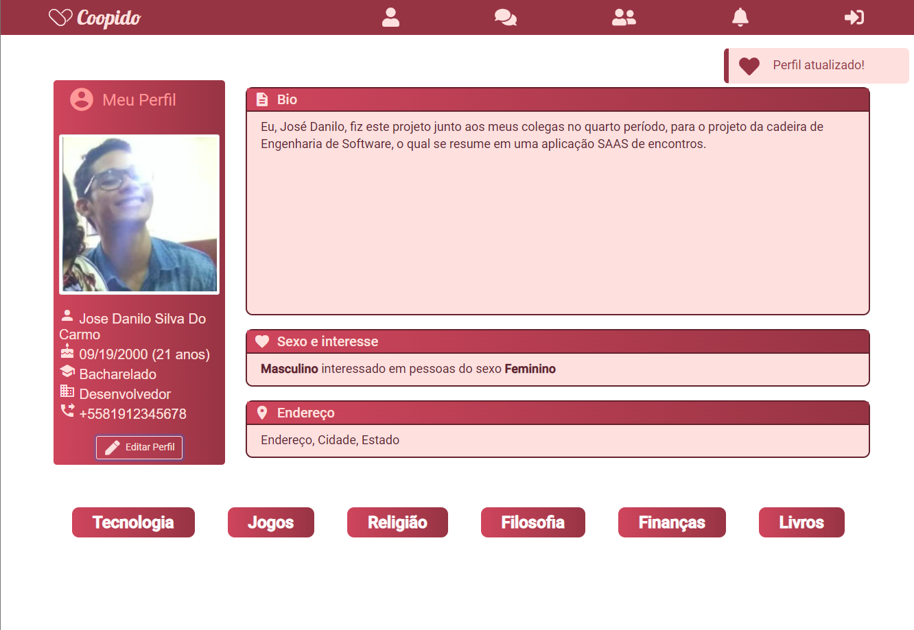

> A Software Engineering Project in the IF682 class. Building a social media application to help people to find love.



## How to run this project

This project has a backend/frontend architecture, so you need to run both, where the backend needs to be run first, then the frontend.

You need to create a .env file in the [backend](./backend/) folder with the following variables, without the comments:

```env
DB_URI=mongodb+srv:// # Database URI connection
FB_TOKEN=123|ABC      # Facebook token
DB_NAME=coopido       # Database name
SECRET=secret         # Secret key
```

### Using NPM

Install the backend dependencies and run it.
```bash
cd backend
npm install
npm start
```

In another terminal, install the frontend dependencies and run it.
```bash
cd frontend
npm install --legacy-peer-deps
npm start
```

### Using Yarn

Install the [yarn](https://classic.yarnpkg.com/en/) if you don't have it.
Install the backend dependencies and run it.
```bash
cd backend
yarn install
yarn dev
```

In another terminal, install the frontend dependencies and run it.
```bash
cd frontend
yarn install
yarn start
```

### Using Docker 

If you want to run the developer version of this project, where you can modify the files and triggers a live reload, you can use the following command:
```bash
docker-compose build
docker-compose up -d
```

>> This option is the most slow! You need to wait the following messages: "Nest application successfully started" and "Compiled successfully" from backend and frontend respectively.

But, if you want to run the production version of this project, where the project will be builded, receiving more performance, you can use the following command:
```bash
docker-compose -f docker-compose.prod.yml build
docker-compose -f docker-compose.prod.yml up -d
```

> Don't forget to remove the previous container if you want to switch between the versions (dev/prod). To see the containers, run `docker container ls -a`, and to remove it `docker container prune` or just `docker-compose down` on the previous version.

### How to test

Run the following command to install the cypress dependencies:
```bash
npm install
```

Run the following command to open the cypress browser:
```bash
cypress open
```
So you can select the integration tests to run.